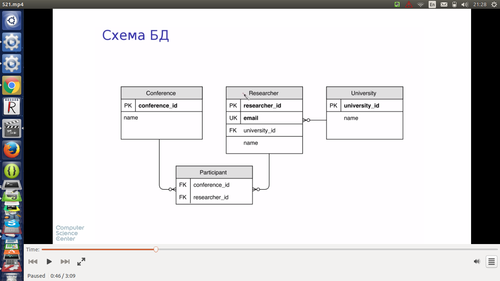
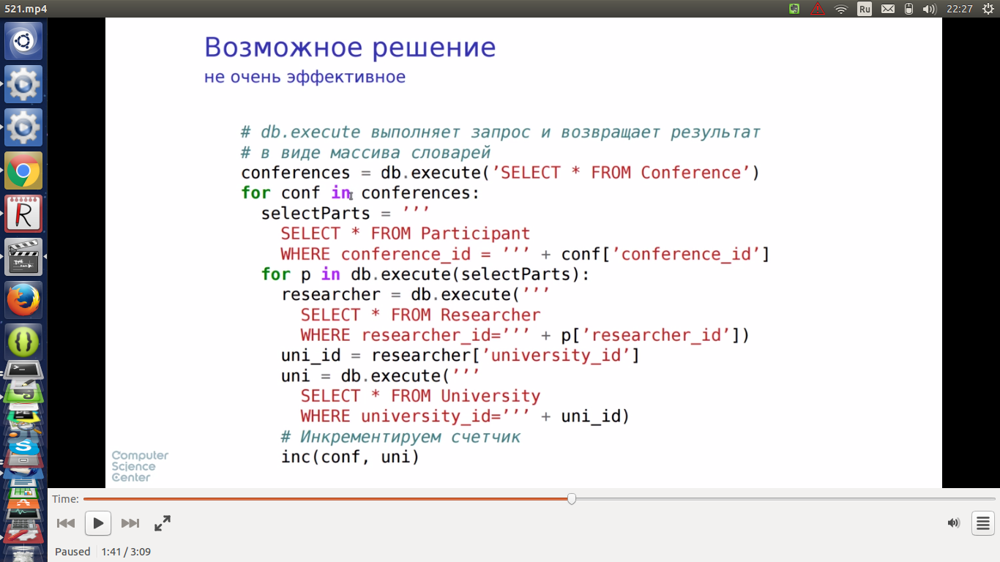
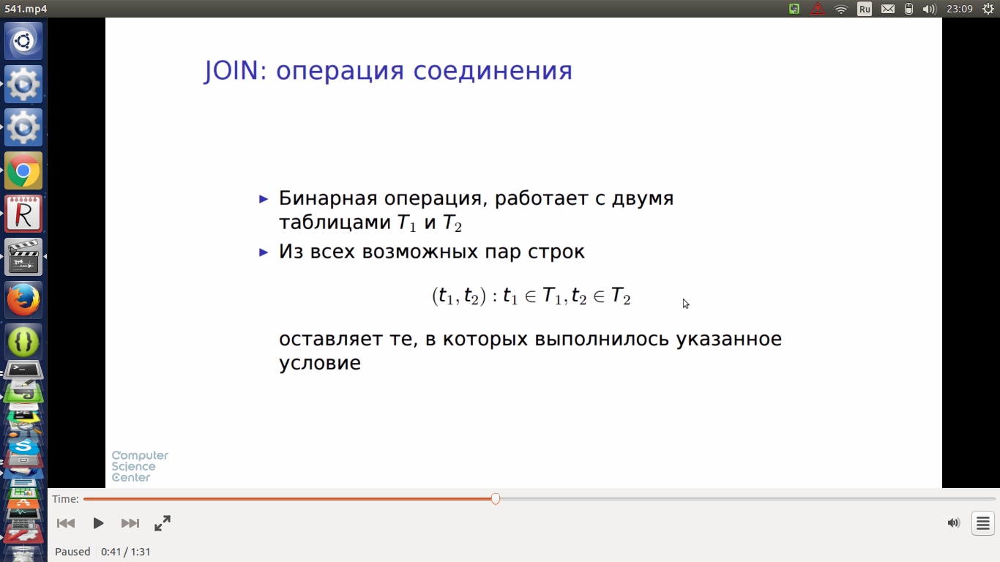
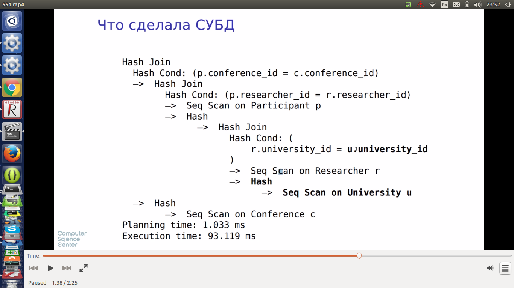
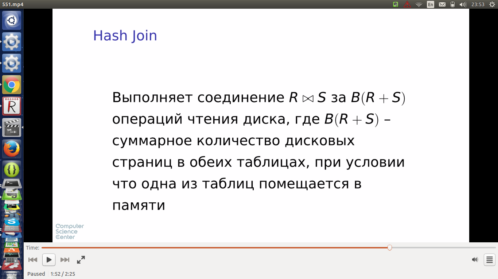
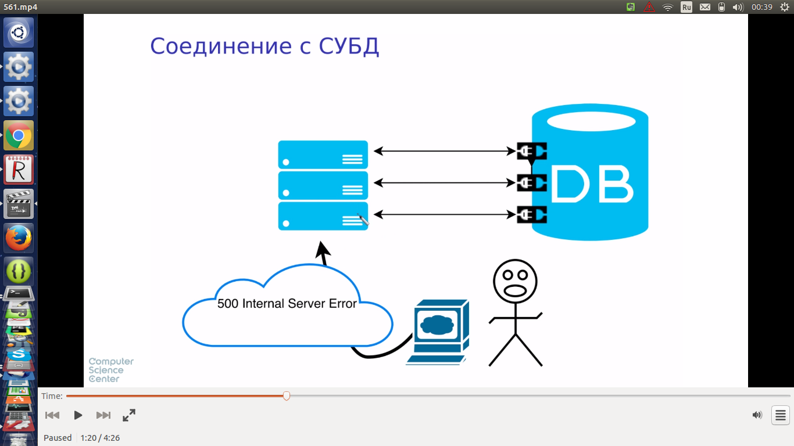
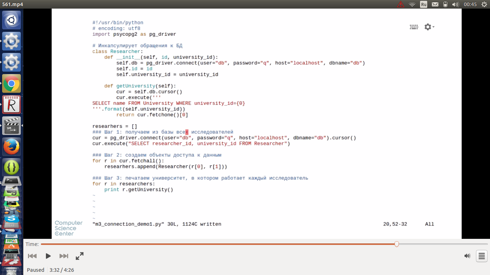

#Задача

* для каждой пары (конференция, университет) найти суммарное количество исследователей из данного университета, участвовавших в данной конференции

* код работает долго из-за большого кол-ва запросов к БД во вложенных циклах. В обработке каждого запроса есть некоторая фикс. составляющая. На ноуте 40с:



* алгоритм выполнения:  


* БД умеет хешировать нужные таблицы в памяти, что позволяет уменьшить время доступа. А также умеет организовывать выполнение запроса (если дать ей весь запрос)




* этот код работает 0.5с вместо 40с:




* hash join работает за линейное время от суммарного размера таблиц при условии, что одна из них помещается в память
* из нее делают хеш-таблицу *ключ join - список строк с данным ключом*
* при проходе другой таблицы на диске ключ join данной строки ищется в хеш-таблице, и если он есть, можно сразу делать join со списком строк, соотвествующим ключу



##Псевдокод алгоритма HashJoin

```python

#Выполняет соединение r и s по условию r.r_join_attr = s.s_join_attr
HashJoin(Relation r, Relation s, String r_join_attr, String s_join_attr):

  #проходим по всей таблице r и  
  #строим словарь с дубликатами, где ключом является значение атрибута соединения из r
  # а в списке значений содержатся строки r
  hash_multimap = new HashMultimap()
  for r_page in r.pages():
    for r_row in r_page.rows():
      hash_multimap[r_row.value(r_join_attr)].add(r_row)

  # проходим по всей таблице s и для каждой строки проверяем наличие в построенном словаре 
  # ключа равного значению атрибута соединения из s
  for s_page in s.pages():
    for s_row in s_page.rows():
      if s_row.value(s_join_attr) in hash_multimap:
        for r_row in hash_multimap.values(s_row.value(s_join_attr)):
          # Если таковой ключ найден то в результат отправляются все пары текущей строки из s
          # и списка значений из r
          emit(r_row, s_row)

```
#Приложение и сессии

* для каждой сессии БД выделяет ресурсы (память под хеш-таблицы, дисковые дескрипторы и пр). Если сессий слишком много ресурсы заканчиваются
* надо закрывать сессии!



* Приложение, плохо обращающееся с сессиями


